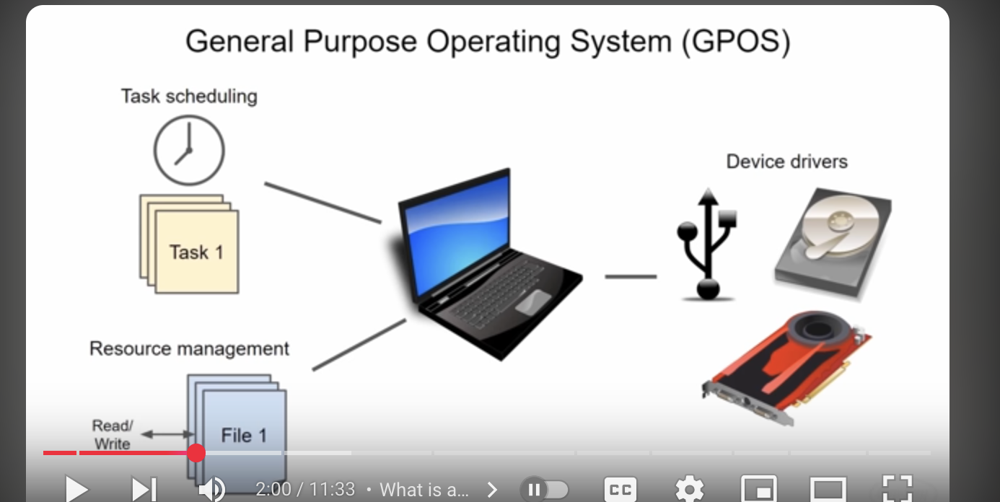
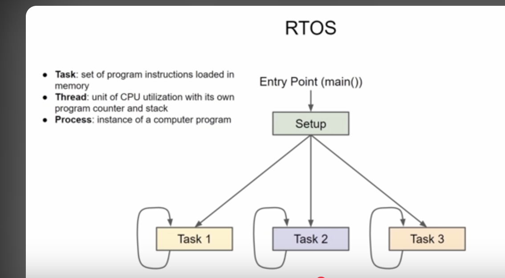

# Introduction to RTOS
(from Youtube Series by : [link](https://www.youtube.com/watch?v=F321087yYy4)

## What is an RTOS?
- Real time operating system

- used for projects with tight timing deadlines, or multiple developers
